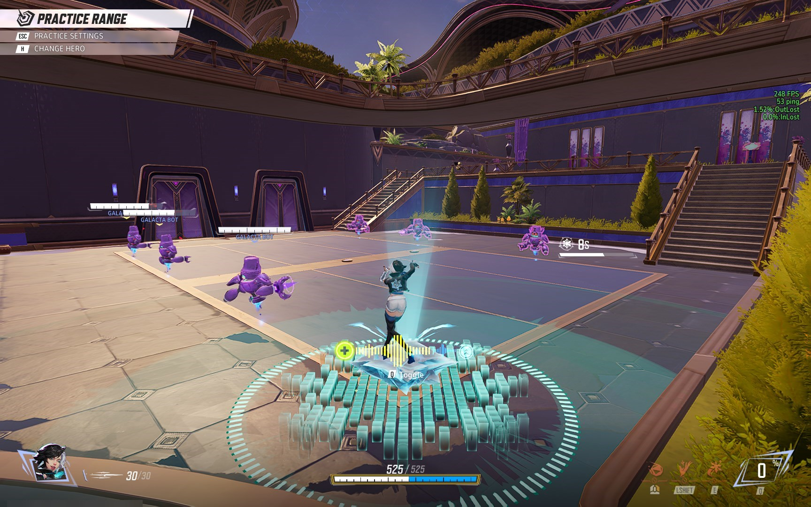

# Read Me
- I just uploaded my current config, so you need to change a few lines before using it.
- Soon I will make it easier so that everyone can apply it.

# Instructions
1. Navigate to %LOCALAPPDATA%\Marvel\Saved\Config\Windows.
2. Open the downloaded archive and move those files into this folder.
- That's it! You can now launch the game and enjoy stable high FPS!

# v0.1-beta

